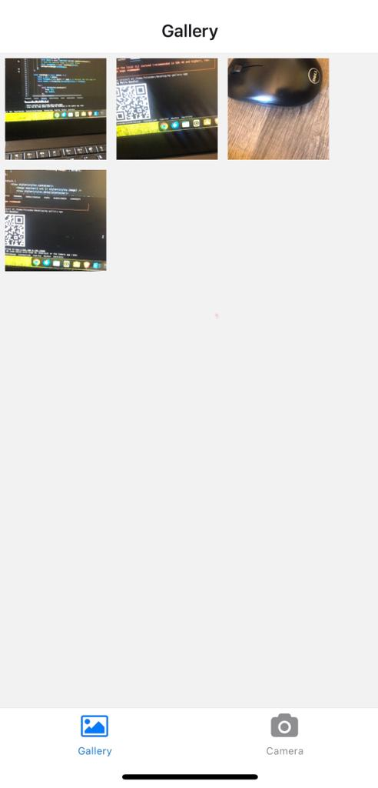

# Gallery App

A simple React Native app for capturing and managing images with camera and geolocation features.

## Table of Contents

- [Description](#description)
- [Screenshots](#screenshots)
- [Features](#features)
- [Getting Started](#getting-started)
  - [Prerequisites](#prerequisites)
  - [Installation](#installation)
- [Usage](#usage)
- [Built With](#built-with)
- [Contributing](#contributing)
- [License](#license)
- [Acknowledgments](#acknowledgments)

## Description

My Gallery App is a mobile application developed using React Native and Expo. It allows users to capture images using the device's camera, associate them with geolocation data, and view them in a gallery format. The app is designed to provide a simple and intuitive interface for managing and exploring images.

## Screenshots



## Features

- Capture images using the device's camera.
- Associate images with geolocation data.
- View images in a gallery format.
- Explore image details, including location and capture date.

## Getting Started

### Prerequisites

Before you begin, ensure you have the following installed:

- Node.js and npm
- Expo CLI

### Installation

1. Clone the repository:

   ```bash
   git clone https://github.com/rachidinicole/gallery-app
   ```
